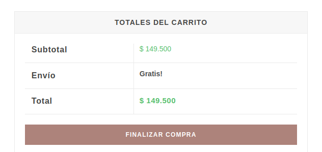

=== Remove Free Shipping Price ===

Contributors:      boterop
Requires at least: 6.3
Tested up to:      6.4
Requires PHP:      7.0
Stable tag:        1.1.0
License:           GPLv2 or later
License URI:       https://www.gnu.org/licenses/gpl-2.0.html
Tags:              plugin best practices, testing, accessibility, performance, security

  

## How it works?

This plugin removes the shipping price when the order total is greater than the free shipping price.
even the "calculate shipping" text is removed.

